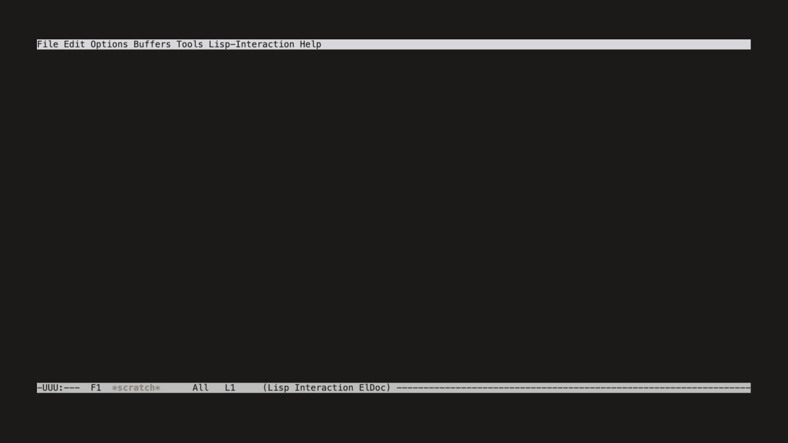
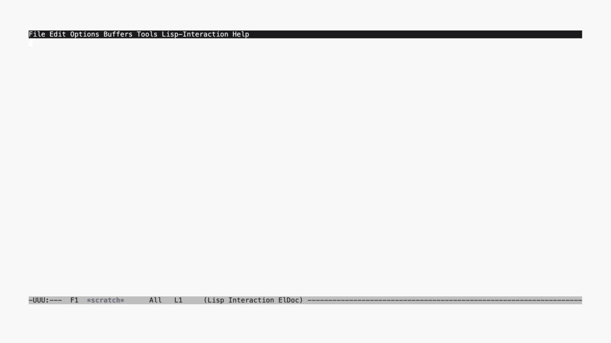

#+TITLE: Emacs Configuration — minimal-emacs.d
#+AUTHOR: kaypark
#+OPTIONS: toc:2 num:t

** Screenshots

| Dark | Light |
|------+-------|
|  |  |

*** Demo

| Dark | Light |
|------+-------|
|  | [[file:docs/light.gif]] |

* Overview

Modular Emacs configuration built on [[https://github.com/jamescherti/minimal-emacs.d][minimal-emacs.d]] (v1.3.1) by James Cherti.
Evil-based editing with SPC leader keys, 47 packages across 7 modules, ~1,300 lines of custom config.

Migrated from Doom Emacs for full control over configuration without framework abstractions.

| Emacs   | >= 29.1 (tested on 30.2)                      |
| OS      | macOS (Intel); should work on Linux            |
| Terminal| WezTerm (Super key CSI decoding for terminal)  |
| Startup | ~0.5s batch, ~1s daemon (M5 Max). Full: 546 features, Denote: 306 features |

* Prerequisites

- Emacs 29.1 or later (native-comp recommended)
- ~git~ for package management (ELPA/MELPA, fetched on first run)
- ~xelatex~ + ~latexmk~ for LaTeX and Org PDF export
- ~enchant~ (v2) + dictionaries for spell checking (jinx)
- ~ripgrep~ (~rg~) and ~fd~ for search (consult integration)
- Tree-sitter support built-in from Emacs 29+; grammars auto-installed on demand

* Installation

#+begin_src bash
# Clone
git clone https://github.com/kayspark/emacs.d ~/.config/emacs

# First run — packages install automatically via use-package
emacs
#+end_src

For daemon mode:

#+begin_src bash
emacs --daemon              # Full daemon (all 47 packages)
emacs --daemon=denote       # Lightweight daemon (12 packages — for Raycast/notes)
#+end_src

Both daemons are managed by launchd (=RunAtLoad + KeepAlive=):

| Daemon  | LaunchAgent                     | Socket                          | Packages | Features |
|---------+---------------------------------+---------------------------------+----------+----------|
| default | =org.gnu.emacs.daemon=          | =~/.config/emacs/server/server= | 47       | 546      |
| denote  | =org.gnu.emacs.denote=          | =~/.config/emacs/server/denote= | 12       | 306      |

*** Shell Aliases (=~/.config/zsh/.zshrc=)

| Alias  | Daemon | Mode     | Command                                      |
|--------+--------+----------+----------------------------------------------|
| =ec=   | denote | GUI      | Quick note viewing/editing                   |
| =ect=  | denote | Terminal | Quick note viewing/editing in terminal        |
| =ecf=  | full   | GUI      | Full editing (magit, LSP, LaTeX, languages)  |
| =ecft= | full   | Terminal | Full editing in terminal                     |

Use =ecf= / =ecft= when you need magit, eglot/LSP, AUCTeX, citar, treesit-auto, or envrc.

The framework files (~early-init.el~, ~init.el~) should not be modified directly.
User configuration goes in ~pre-early-init.el~, ~post-init.el~, and ~lisp/*.el~.

* File Structure

#+begin_example
~/.config/emacs/
├── early-init.el            # minimal-emacs.d bootstrap (DO NOT EDIT)
├── init.el                  # Package setup, use-package (DO NOT EDIT)
├── pre-early-init.el        # Frame defaults, UI features (user hook)
├── post-init.el             # Module loader (dispatches denote vs full)
├── custom.el                # Customize-set-variables (auto-generated)
└── lisp/
    ├── init-evil.el         # Evil + general.el + which-key
    ├── init-completion.el   # Vertico + corfu + consult + embark
    ├── init-ui.el           # Theme, fonts, modeline, editor defaults
    ├── init-tools.el        # Magit, eglot, treesit, formatting, spell
    ├── init-languages.el    # Python, Java, LaTeX, Rust, R, SQL, Markdown
    ├── init-org.el          # Org-mode, citations, denote, babel
    ├── init-latex-classes.el  # LaTeX export class definitions
    └── init-denote-server.el  # Minimal init for denote daemon (12 packages)
#+end_example

* Module Reference

** ~init-evil.el~ — Evil Mode

Vim keybindings with SPC leader via general.el. ~C-u~ / ~C-d~ half-page scroll enabled.
~evil-want-C-i-jump~ set to ~nil~ to free TAB for ~org-cycle~ in terminal.

*Packages:* evil, evil-collection, evil-terminal-cursor-changer, general, which-key

** ~init-completion.el~ — Completion

Minibuffer: vertico + orderless (flex matching) + marginalia (annotations).
In-buffer: corfu (auto-popup) + cape (dabbrev, file).
Search: consult (ripgrep, fd, line, imenu, outline, agenda).
Actions: embark (contextual actions on candidates).

*Packages:* vertico, orderless, marginalia, corfu, cape, consult, consult-dir,
embark, embark-consult, nerd-icons-completion, nerd-icons-corfu

** ~init-ui.el~ — UI & Theme

Theme: nepes-themes (~nepes-dark~ / ~nepes-light~ toggle).
Fonts: Iosevka Nerd Font Mono (base) + Paperlogy (Korean hangul).
Modeline: doom-modeline. Git gutters: diff-hl. Undo tree: vundo.
Relative line numbers enabled globally.
Daemon warm-up: pre-initializes hidden NS frame at daemon startup for faster first ~emacsclient -c~.

*Packages:* nepes-themes (vc), doom-modeline, diff-hl, hl-todo, vundo, ws-butler

** ~init-tools.el~ — Dev Tools

Git: magit (status, log, blame). Diff: ediff (side-by-side, window restore).
LSP: eglot (built-in) with texlab (LaTeX), sqls (SQL).
Tree-sitter: treesit-auto (grammar auto-install). Direnv: envrc.
Formatting: apheleia (async, sqlfluff for Oracle SQL).
Spell: jinx (enchant backend). PDF: pdf-tools.

*Packages:* magit, treesit-auto, envrc, apheleia, jinx, editorconfig,
pdf-tools, nerd-icons-dired, vundo, ws-butler

** ~init-languages.el~ — Languages

Python: eglot + flymake-ruff.
Java: jdtls via eglot (reuses Neovim Mason install), JDK 8/11/21 (Temurin).
LaTeX: AUCTeX (~tex~) with xetex engine + PDF mode, cdlatex (snippets), laas (auto-subscript).
Markdown: native syntax highlighting in fenced code blocks (~markdown-fontify-code-blocks-natively~), faces aligned with org-mode.
Also: Rust (rustic), R, C, SQL.

*Packages:* tex (AUCTeX), cdlatex, laas, flymake-ruff, rustic, markdown-mode

** ~init-org.el~ — Org Mode

TODO states: PLANNED / TODO / PROG / REVIEW / DONE / CANCEL (with color faces).
Agenda, citations (citar + citar-embark), notes (denote + consult-denote),
PDF annotations (org-noter), image paste (org-download), code export (engrave-faces).
Babel: Python, SQLite, ditaa, LaTeX.

*Packages:* org-modern, citar, citar-embark, org-noter, denote,
consult-denote, org-download, engrave-faces, mixed-pitch

** ~init-latex-classes.el~ — LaTeX Classes

Org-export class definitions for custom document classes (nepes-article, nepes-beamer).
XeLaTeX with Korean font support: Paperlogy (sans), Noto Serif KR (serif),
NanumGothicCoding (mono), Times New Roman / Arial (English).
Pure config — no packages.

** ~init-denote-server.el~ — Lightweight Denote Daemon

Minimal init loaded when =emacs --daemon=denote= is used. Provides fast startup (<1s) for [[https://github.com/kayspark/raycast-denote][Raycast denote]] integration.

*Packages (12):* evil, general, which-key, vertico, orderless, nepes-themes, doom-modeline, org, org-modern, denote

*Skips (35+):* evil-collection, corfu, cape, marginalia, consult, embark, treesit-auto, envrc, magit, apheleia, jinx, pdf-tools, all language modes, LaTeX classes, citar, ess, org-noter, org-download, engrave-faces

Dispatch logic in ~post-init.el~:

#+begin_src elisp
(when (equal (daemonp) "denote")
  (require 'init-denote-server))
#+end_src

=(daemonp)= returns the daemon name as a string with =--daemon=NAME=.

* Key Bindings

** Top-level

| Key       | Action                         |
|-----------+--------------------------------|
| ~SPC SPC~ | M-x (execute-extended-command) |
| ~SPC /~   | Grep project (ripgrep)         |
| ~SPC :~   | Eval expression                |
| ~SPC .~   | Find file                      |
| ~SPC ,~   | Switch buffer                  |
| ~SPC a~   | Embark act                     |
| ~SPC '~   | Embark dwim                    |

** Buffers (~SPC b~)

| Key       | Action       |
|-----------+--------------|
| ~SPC b b~ | Switch       |
| ~SPC b n~ | Next         |
| ~SPC b p~ | Previous     |
| ~SPC b d~ | Kill         |
| ~SPC b m~ | Bookmark set |
| ~SPC b s~ | Save         |
| ~SPC b S~ | Save all     |

** Code / LSP (~SPC c~)

| Key       | Action       |
|-----------+--------------|
| ~SPC c a~ | Code actions |
| ~SPC c r~ | Rename       |

** Embark (~SPC e~)

| Key       | Action  |
|-----------+---------|
| ~SPC e c~ | Collect |
| ~SPC e e~ | Export  |
| ~SPC e l~ | Live    |

** Files (~SPC f~)

| Key       | Action    |
|-----------+-----------|
| ~SPC f f~ | Find      |
| ~SPC f d~ | Directory |
| ~SPC f r~ | Recent    |
| ~SPC f s~ | Save      |
| ~SPC f R~ | Rename    |

** Git (~SPC g~)

| Key       | Action |
|-----------+--------|
| ~SPC g g~ | Status |
| ~SPC g l~ | Log    |
| ~SPC g b~ | Blame  |

** Help (~SPC h~)

| Key       | Action   |
|-----------+----------|
| ~SPC h f~ | Function |
| ~SPC h v~ | Variable |
| ~SPC h k~ | Key      |

** Insert (~SPC i~)

| Key       | Action                       |
|-----------+------------------------------|
| ~SPC i p~ | Paste image (org-download)   |

** Notes / Denote (~SPC n~)

| Key         | Action          |
|-------------+-----------------|
| ~SPC n n~   | New note        |
| ~SPC n f~   | Open/create     |
| ~SPC n l~   | Insert link     |
| ~SPC n b~   | Backlinks       |
| ~SPC n r~   | Rename          |
| ~SPC n s~   | Grep notes      |
| ~SPC n F~   | Find note       |
| ~SPC n p n~ | New paper note  |
| ~SPC n p f~ | Find paper note |
| ~SPC n p s~ | Grep paper notes|

** Open (~SPC o~)

| Key       | Action        |
|-----------+---------------|
| ~SPC o a~ | Org agenda    |
| ~SPC o p~ | Project dired |

** Project (~SPC p~)

| Key       | Action    |
|-----------+-----------|
| ~SPC p p~ | Switch    |
| ~SPC p f~ | Find file |
| ~SPC p s~ | Search    |

** Search (~SPC s~)

| Key       | Action           |
|-----------+------------------|
| ~SPC s b~ | Bookmark         |
| ~SPC s d~ | Diagnostics      |
| ~SPC s D~ | Buf diagnostics  |
| ~SPC s F~ | fd find          |
| ~SPC s g~ | Grep (ripgrep)   |
| ~SPC s G~ | Git grep         |
| ~SPC s i~ | Imenu            |
| ~SPC s m~ | Mark             |
| ~SPC s M~ | Global mark      |
| ~SPC s o~ | Outline          |
| ~SPC s r~ | Search replace   |
| ~SPC s s~ | Line (consult)   |
| ~SPC s t~ | TODO/FIXME/HACK  |

** Toggle (~SPC t~)

| Key       | Action       |
|-----------+--------------|
| ~SPC t f~ | Word wrap    |
| ~SPC t l~ | Line numbers |

** Diagnostics (~SPC x~)

| Key       | Action          |
|-----------+-----------------|
| ~SPC x x~ | Diagnostics     |
| ~SPC x X~ | Buf diagnostics |

** Quit (~SPC q~)

| Key       | Action         |
|-----------+----------------|
| ~SPC q q~ | Quit client    |
| ~SPC q Q~ | Kill emacs     |
| ~SPC q r~ | Restart daemon |
| ~SPC q f~ | Delete frame   |

** Window (~SPC w~)

| Key       | Action      |
|-----------+-------------|
| ~SPC w d~ | Delete      |
| ~SPC w s~ | Split below |
| ~SPC w v~ | Split right |
| ~SPC w m~ | Maximize    |
| ~C-w z~   | Zoom toggle |

** Clipboard (~SPC y~)

| Key         | Mode   | Action               |
|-------------+--------+----------------------|
| ~SPC y~     | visual | Yank to clipboard    |
| ~SPC y p~   | normal | Paste after          |
| ~SPC y P~   | normal | Paste before         |

** Org Local Leader (~SPC m~ in org-mode)

| Key         | Action         |
|-------------+----------------|
| ~SPC m @~   | Insert citation|
| ~SPC m v~   | View export    |
| ~SPC m N n~ | Noter: open    |
| ~SPC m N i~ | Noter: insert  |
| ~SPC m N s~ | Noter: sync    |
| ~SPC m N j~ | Noter: next    |
| ~SPC m N k~ | Noter: prev    |
| ~SPC m N q~ | Noter: quit    |

** Org z-prefix (normal mode in org buffers)

| Key  | Action                 |
|------+------------------------|
| ~z*~ | Jump to heading start  |
| ~z@~ | Mark subtree           |
| ~z^~ | Sort                   |
| ~zb~ | Backward same-level    |
| ~zf~ | Forward same-level     |
| ~zn~ | Next visible heading   |
| ~zp~ | Prev visible heading   |
| ~zu~ | Up heading             |
| ~zz~ | Refile                 |

** Bracket Navigation (~]~ / ~[~)

Unified across org, markdown, and programming modes. Matches Neovim convention.

| Key      | Scope    | Action                |
|----------+----------+-----------------------|
| ~]]~     | org/md   | Next heading          |
| ~[[~     | org/md   | Prev heading          |
| ~]h~     | org/md   | Next heading (alias)  |
| ~[h~     | org/md   | Prev heading (alias)  |
| ~]s~     | org      | Next same-level       |
| ~[s~     | org      | Prev same-level       |
| ~]u~     | org/md   | Parent heading        |
| ~]f~     | prog     | Next function         |
| ~[f~     | prog     | Prev function         |
| ~]c~     | prog     | Next class (treesit)  |
| ~[c~     | prog     | Prev class (treesit)  |

** WezTerm Pane Navigation

~C-h/j/k/l~ crosses Emacs window splits AND WezTerm panes seamlessly.
Tries ~windmove~ first; if at edge, calls ~wezterm cli activate-pane-direction~.
Matches Neovim ~smart-splits.nvim~ behavior.

| Key    | Action     |
|--------+------------|
| ~C-h~  | Pane left  |
| ~C-j~  | Pane down  |
| ~C-k~  | Pane up    |
| ~C-l~  | Pane right |

** LaTeX (AUCTeX)

| Key       | Action                              |
|-----------+-------------------------------------|
| ~C-c C-a~ | Run all (compile until PDF ready)   |
| ~C-c C-c~ | Run next command (LaTeX, View, ...) |
| ~C-c C-v~ | View PDF                            |

* Dependencies

** Minimal Setup

For basic Evil + completion + UI editing (no LaTeX, no LSP, no spell check):

#+begin_src bash
# macOS (MacPorts)
port install bash coreutils ripgrep fd
#+end_src

** Full Setup

#+begin_src bash
# macOS (MacPorts)
port install bash coreutils ripgrep fd enchant2 hunspell-en \
  texlive texlab latexmk python313 uv
#+end_src

** Dependency Reference

*** Core

| Tool           | Purpose            | Required?  | Install                    |
|----------------+--------------------+------------+----------------------------|
| bash           | Shell interpreter  | Required   | ~port install bash~        |
| gls (GNU ls)   | Dired listing      | Required   | ~port install coreutils~   |

*** Language Servers

| Server  | Mode  | Required?        | Install                                              |
|---------+-------+------------------+------------------------------------------------------|
| texlab  | LaTeX | Required (LaTeX) | ~port install texlab~                                |
| jdtls   | Java  | Required (Java)  | via Mason (~nvim~) or manual                         |
| sqls    | SQL   | Required (SQL)   | ~go install github.com/sqls-server/sqls@latest~      |
| R       | R     | Required (R)     | ~install.packages("languageserver")~ in R            |

*** TeX

| Tool    | Purpose            | Required?          | Install                  |
|---------+--------------------+--------------------+--------------------------|
| xelatex | LaTeX compiler     | Required (LaTeX)   | ~port install texlive~   |
| latexmk | Build automation   | Required (Org PDF) | ~port install latexmk~   |

*** Spell Check

| Tool           | Purpose                    | Required? | Install                              |
|----------------+----------------------------+-----------+--------------------------------------|
| enchant2       | Spell backend (jinx)       | Optional  | ~port install enchant2 +hunspell~    |
| hunspell dicts | Dictionaries (en_US, ko)   | Optional  | ~port install hunspell-en hunspell-ko~ |

Jinx uses enchant2 as its backend. The ~+hunspell~ variant is required for named
dictionary lookup (e.g. ~ko_KR~). The default ~+applespell~ variant handles Korean
transparently but doesn't advertise ~ko_KR~ as a dictionary name.

Dictionary files (~.aff~ / ~.dic~) must be in ~/opt/local/share/hunspell/~.
If installed elsewhere (e.g. =~/Library/Spelling/=), symlink them:

#+begin_src shell :tangle no
sudo ln -s ~/Library/Spelling/ko_KR.{aff,dic} /opt/local/share/hunspell/
sudo ln -s ~/Library/Spelling/en_US.{aff,dic} /opt/local/share/hunspell/
#+end_src

Languages configured in ~init-tools.el~: ~jinx-languages~ = ~"en_US ko_KR"~.

*** Search

| Tool         | Purpose          | Required?   | Install                  |
|--------------+------------------+-------------+--------------------------|
| ripgrep (rg) | consult-ripgrep  | Recommended | ~port install ripgrep~   |
| fd           | consult-fd       | Recommended | ~port install fd~        |

*** Tree-sitter

| Tool                  | Purpose              | Required? | Install                              |
|-----------------------+----------------------+-----------+--------------------------------------|
| tree-sitter grammars  | Syntax highlighting  | Optional  | Auto-installed by treesit-auto       |

Grammars are installed on first use when ~treesit-auto-install~ is set to ~prompt~.

*** Python

| Tool    | Purpose              | Required?        | Install                    |
|---------+----------------------+------------------+----------------------------|
| python3 | Python mode + babel  | Required (Python)| ~port install python313~   |
| uv      | Venv management      | Recommended      | ~port install uv~          |

*** Java

| Tool                | Purpose          | Required?      | Install                                |
|---------------------+------------------+----------------+----------------------------------------|
| OpenJDK 8 (Temurin) | Default runtime  | Required (Java)| ~port install openjdk8-temurin~        |
| OpenJDK 11/21       | Alt runtimes     | Optional       | ~port install openjdk11-temurin~       |
| jdtls               | Java LSP         | Required (Java)| via Mason or manual install            |

*** Fonts

| Font                   | Usage              | Source                          |
|------------------------+--------------------+---------------------------------|
| Iosevka Nerd Font Mono | Base monospace     | nerdfonts.com                   |
| Paperlogy              | Korean sans-serif  | github.com/pjhnum7/Paperlogy   |
| NanumGothicCoding      | Korean monospace   | ~port install NanumGothicCoding~ |
| Noto Serif KR          | Korean serif       | Google Fonts                    |
| Symbols Nerd Font      | Icons/symbols      | nerdfonts.com                   |
| Apple Color Emoji      | Emoji              | Built-in (macOS)                |

Fonts are only loaded in GUI frames. Terminal Emacs uses the terminal emulator font.

*** PDF Viewers

| Application  | Purpose            | Required?         | Source               |
|--------------+--------------------+-------------------+----------------------|
| Preview.app  | Default PDF viewer | Built-in (macOS)  | ---                  |
| Skim         | PDF sync viewer    | Optional          | skim-app.sourceforge.io |
| pdf-tools    | In-Emacs viewer    | Optional          | MELPA (auto-installed) |

* Known Issues

- ~evil-want-C-i-jump~ set to ~nil~: frees TAB for ~org-cycle~ in terminal, but loses ~C-i~ jump-forward.
- Full daemon loads 240 more features than denote daemon (546 vs 306). Both start in ~1s on M5 Max (the 33s figure was from older hardware). Use =--daemon=denote= for isolation (no envrc, treesit-auto, magit hooks).
- ~TeX-master~ prompts on first open of ~.tex~ files (set to ~t~ = self by default).
- ~kp/eglot-ensure-safe~ guards eglot: skips LSP start if no GUI frame exists (daemon safety).
- ~pdf-tools~ does not work in terminal Emacs; falls back to ~Preview.app~ for PDF viewing.

* Testing

** Batch Startup

#+begin_src bash
emacs --batch -l ~/.config/emacs/early-init.el \
  -l ~/.config/emacs/init.el \
  --eval '(load-file "~/.config/emacs/post-init.el")' 2>&1
#+end_src

** LaTeX Export (with nepes-latex templates)

#+begin_src bash
cd ~/workspace/nepes-latex-template
emacs --batch -l test-export.el
#+end_src

This exports 7 org/tex files (article dark/light/report, beamer dark/light, size-control variants).

** Verify AUCTeX

#+begin_src bash
emacsclient -e '(with-current-buffer (find-file-noselect "/tmp/test.tex")
  (list major-mode (bound-and-true-p TeX-PDF-mode) TeX-engine))'
# Expected: (LaTeX-mode t xetex)
#+end_src

* Credits

- [[https://github.com/jamescherti/minimal-emacs.d][minimal-emacs.d]] by James Cherti --- base framework (v1.3.1, GPL-3.0+)
- [[https://github.com/doomemacs/doomemacs][Doom Emacs]] --- prior configuration, keybinding inspiration
- Evil + general.el + evil-collection ecosystem

** License

GPL-3.0-or-later (same as minimal-emacs.d).
